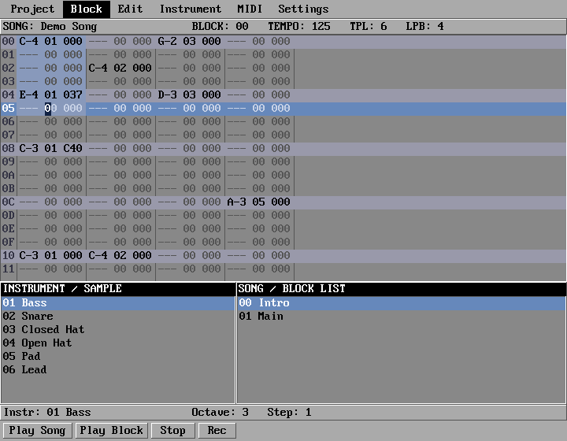
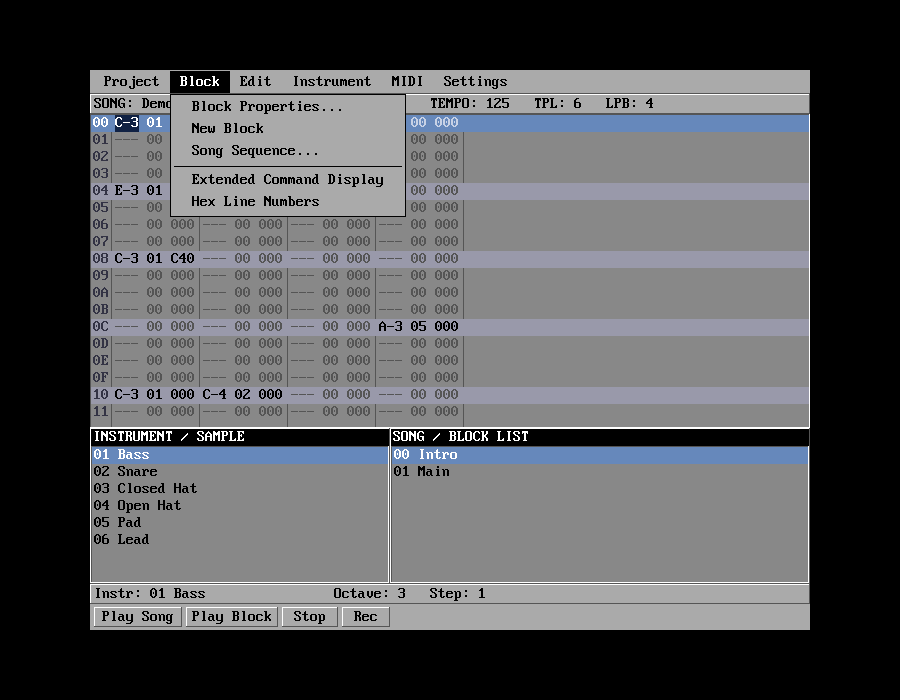

# Paula


A music tracker for **LyxOS**, written in the **Lyx** language on the **Vega** VCL,
modelled on **OctaMED Professional V5/V6** for the Commodore Amiga.

Named after the Amiga's sound chip — the part that gave those machines their voice.



Paula is not an OctaMED emulator and not a modern DAW. It is a tracker built the way trackers
were built: a fixed 8×16 bitmap grid, hard-edged Amiga-style widgets, notes typed as
`C-3 01 000`, and playback backends that reproduce historical behaviour instead of smoothing
it away. Four-channel Paula mode really is limited to four voices with hard left/right panning
and 8-bit resolution — because that is what made it sound the way it did.

---

## Features

- **Block editor** — 64 lines × 4 tracks by default, cursor per cell field, beat lines, hex or
  decimal line numbers, block-local track and line counts (as in OctaMED, unlike ProTracker).
- **Classic tracker keyboard entry** — two-row piano layout, octave and step control, hex entry
  into instrument, command and level fields.
- **Three playback backends** behind one abstract interface — the same song sounds audibly
  different in each.
- **Effect commands** `00`–`1F` including the `0F` special cases, plus a separate MIDI command
  dispatch for MIDI tracks.
- **File formats** — reads MMD0/MMD1/MMD2 (OctaMED), ProTracker MOD and Scream Tracker 3 S3M,
  writes MMD1, loads IFF-8SVX and raw 8-bit samples.
- **MIDI output** — an instrument with a MIDI channel plays on the device instead of the
  sample backend; both run side by side from the same block.
- **Song sequence and sections**, block properties, range operations (cut/copy/paste/clear,
  transpose, split, join).

## Playback modes

| Mode | Voices | Character |
|---|---|---|
| **4 Channel Paula** (default) | 4 | Hard panning (channels 0/3 left, 1/2 right), volume applied *before* 8-bit resolution, period clamped at 124 (~28.8 kHz) |
| **8 Channel OctaMED** | 8 | Two voices mixed per hardware channel, halved dynamic range per voice — the quieter, grittier sound |
| **Modern Mixer** | 8 | Linear mixing in 16 bit, no hardware limits |

The differences are measurable, not cosmetic: rendering the same song, a single voice peaks at
16128 in Paula mode and 8064 in 8-channel mode; at volume 2 the Paula backend quantises to 384
where the mixer resolves 504.

---

## Requirements

- `lyxc` — the Lyx compiler (tested with 1.1.2H)
- `lpm` — the Lyx package manager, for fetching dependencies
- The Lyx standard library (`aurum`), which ships with the compiler
- X11 for the interface, ALSA for audio output (PipeWire works through its ALSA layer)

Vega is **not** vendored in this repository. It is a dependency, declared in `lyx.toml` and
pinned in `lyx.lock`, and `lpm` fetches it.

> **One patch is required.** Vega 0.1.1 declares the module variables `_active` and
> `_activeApp` *after* the `TFileDialog` class that uses them, and `lyxc` allocates such a
> variable twice — `Execute` writes to one, the handlers read the other. Confirming a file in
> the open/save dialog then dereferences a null pointer and the program dies. Apply
> [`patches/vega-0.1.1-filedlg-module-vars.patch`](patches/vega-0.1.1-filedlg-module-vars.patch)
> to the fetched package (it simply moves the two declarations above the class), or avoid
> *Load Song* and *Load Sample*.

## Building

```sh
# 1. Install the Lyx compiler and lpm (see the Lyx distribution)

# 2. Fetch the dependencies declared in lyx.toml — this resolves Vega 0.1.1
lpm install

# 3. Build
lyxc paula.lyx -I /path/to/aurum -o paula

# 4. Run
./paula
```

`lpm list` shows what was resolved, `lpm info vega` details the package.

For LyxOS, build as an ELF and stage it in `build.sh`, then launch from the compositor with
`SysSpawnAsync("/paula.elf"c)`. Audio there needs a VM with an AC97 controller:

```sh
VBoxManage modifyvm LyxOS --audio-driver pulse --audio-controller ac97 \
  --audio-enabled on --audio-out on
```

---

## Usage

### Moving around

| Key | Action |
|---|---|
| Arrow up/down | Move one line; wraps at the end of the block |
| Arrow left/right | Move between cell fields, across track boundaries |
| Ctrl + left/right | Move one whole track |
| Page up/down | Move LPB × 4 lines |
| Home / End | First / last line (Ctrl+Home also resets track and field) |
| Space | Toggle edit mode (cursor turns orange) |
| Mouse wheel | Scroll the view without moving the cursor |

`Tab` is not available — Vega's dispatcher consumes it for focus handling before any control
sees it, hence Ctrl+arrow for track changes.

### Entering notes

Writing only happens in edit mode.

| Key | Action |
|---|---|
| `Z S X D C V G B H N J M` | Notes C..B in the current octave |
| `Q 2 W 3 E R 5 T 6 Y 7 U` | The same notes one octave up |
| `0`–`9`, `A`–`F` | Hex digit into instrument, command or level field |
| `-` / `+` | Input octave 1..6 (works outside edit mode too) |
| `Del` | Clear cell, then advance by step |
| `Backspace` | Clear cell, move up one line |
| `Return` / `Shift+Return` | Insert / delete a line |
| Shift + arrows, drag with mouse | Select a range |

Number keys are the sharps of the upper row rather than octave selection — otherwise half of
that row would have no accidentals. Octave lives on `-` and `+`.

### Menus

`Project` load and save songs · `Block` properties, new block, song sequence, split, join,
transpose · `Edit` cut, copy, paste and clear range · `Instrument` properties, load sample ·
`MIDI` device setup · `Settings` playback mode



---

## File formats

| Format | Read | Write | Notes |
|---|---|---|---|
| MMD0 | yes | — | 3-byte notes, instrument high bits packed into the note byte |
| MMD1 | yes | yes | 4-byte notes; the format Paula saves in |
| MMD2 / MMD3 | yes | — | Sections become multiple playing sequences |
| ProTracker MOD | yes | — | M.K., M!K!, FLT4/8, 4CHN, 6CHN, 8CHN, CD81, OKTA |
| Scream Tracker 3 (S3M) | yes | — | Up to 16 channels, packed patterns, unsigned samples, per-instrument c2spd |
| IFF-8SVX | yes | — | Samples; Fibonacci-delta compression is rejected, not guessed |
| Raw 8-bit | yes | — | Headerless sample data |

Paula always writes MMD1: MMD0 cannot represent commands above `0F` or 6-bit instrument
numbers, and MMD2 would only add sections. Effects from MOD and S3M files are mapped onto
OctaMED command numbers; anything without an equivalent is dropped rather than mistranslated.

S3M is a PC format and is treated as one. Its instruments are tuned by playback rate (`c2spd`)
rather than by an Amiga period table, so periods are scaled per instrument, and such a song
opens in **Modern Mixer** mode — the hardware limits would be a defect here, not authenticity.

---

## Project layout

```
paula.lyx           main window, menus, wiring
paula.theme         Amiga Workbench styling (Vega theme file)
OMED/
  Song.lyx          song, blocks, instruments, playing sequences
  Widgets.lyx       block editor grid, lists, buttons, info bars
  Theme.lyx         colours and bevels
  Sample.lyx        IFF-8SVX and raw sample loading
  Playback.lyx      voices, Amiga periods, the three backends
  Replay.lyx        tick/line/block/sequence logic, command dispatch
  Audio.lyx         ALSA output (AC97 on LyxOS)
  Midi.lyx          raw MIDI output
  MMD.lyx           MMD0/1/2 reader and MMD1 writer
  MOD.lyx           ProTracker MOD reader
  S3M.lyx           Scream Tracker 3 reader
  Dialogs.lyx       block properties, song sequence, instrument, MIDI setup
docs/DESIGN.de.md   the original design specification (German)
```

Source comments are in German, as is the design document.

## Tests

Each test is a standalone program that runs without a window or a sound card:

```sh
lyxc replaytest.lyx -I /path/to/aurum -o replaytest && ./replaytest   # engine, commands, timing
lyxc mmdtest.lyx    -I /path/to/aurum -o mmdtest    && ./mmdtest      # MMD read/write round trip
lyxc miditest.lyx   -I /path/to/aurum -o miditest   && ./miditest     # MIDI byte stream
lyxc modtest.lyx    -I /path/to/aurum -o modtest    && ./modtest      # MOD import
lyxc s3mtest.lyx    -I /path/to/aurum -o s3mtest    && ./s3mtest      # S3M import
lyxc sampletest.lyx -I /path/to/aurum -o sampletest && ./sampletest   # samples, periods, mixing
lyxc renderwav.lyx  -I /path/to/aurum -o renderwav  && ./renderwav    # render to WAV per backend
```

`renderwav` writes the same song through all three backends, which is the quickest way to hear
what a change did — and to check it without an audio device.

`playtest.lyx`, `loadtest.lyx` and `latencytest.lyx` are diagnostic tools rather than tests:
they measure device buffer size, playback lead, dropouts and per-tick rendering cost. They were
written while chasing an audio problem and are kept because that problem will come back.

---

## Status

All ten phases of the design document are implemented: main window, block editor, keyboard
entry, sample playback, Paula mode, 8-channel mode, effect commands, song sequence, MIDI and
MMD import. Saving, MOD import and range operations were added afterwards.

### Known limitations

- Commands `08` (as a command; instrument hold/decay does work), `0E`, `17`, `1C` and the
  mix-mode commands `20`–`2F` are not implemented.
- No sample editor, no preferences window.
- No MMD2 export — saving keeps only the current section's sequence.
- Redrawing the grid blocks Vega's loop for up to 335 ms, so audio runs with a 400 ms lead.
  The cursor therefore runs slightly ahead of the sound.

---

## Contributing

Issues and pull requests are welcome. Two things worth knowing before you start:

- **Historical behaviour is a feature.** If a change makes the Paula backend sound cleaner, it
  is probably wrong. Limits belong in the backends, not in shared code.
- **Terminology is fixed**: song, block, track, line, instrument, sample, command, sequence.
  Not clip, scene, lane, device or pattern.

## A note on module files

The repository ships no music. Amiga modules are other people's work — if you want something to
listen to, fetch a MOD or MMD file yourself (for instance from [The Mod Archive](https://modarchive.org/))
and open it with *Project → Load Song*.

## License

[MIT](LICENSE) — Copyright (c) 2026 Andreas Röne.

## Acknowledgements

- OctaMED by Teijo Kinnunen and RBF Software — the program this one takes after.
- The [libxmp](https://github.com/libxmp/libxmp) format documentation, in particular
  [the OctaMED SoundStudio effect reference](https://github.com/libxmp/libxmp/blob/master/docs/formats/octamedss1.03-effects.txt).

OctaMED, Amiga and ProTracker are the property of their respective owners. This project is not
affiliated with any of them.
